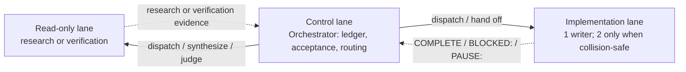

# Harness Echelon

> Implementation waits for the Architect's seal.

**Harness Echelon** is a lightweight, drop-in hierarchical orchestration harness for LLM coding agents. It is a pure file protocol — no code, no dependencies, nothing to install — that turns a single agent session into a governed multi-agent execution system: approved evidence precedes implementation, one writer runs by default with a second only when collision-safe, researched decisions are approved and decomposed progressively, and all execution state lives in reviewable files instead of chat context.

Copy four files into any codebase — five if you keep both rule entrypoints — and your agent adopts the protocol.

## Table of contents

- [Why](#why)
- [The three roles](#the-three-roles)
- [The document chain](#the-document-chain)
- [Execution model](#execution-model)
- [Task lifecycle](#task-lifecycle)
- [Safety rails](#safety-rails)
- [Repository layout](#repository-layout)
- [Quick start](#quick-start)
- [Compatibility](#compatibility)
- [Configuration](#configuration)
- [Design principles](#design-principles)
- [License](#license)

## Why

Handing a coding agent an open-ended goal tends to fail in predictable ways. Harness Echelon gives each failure a structural countermeasure:

- **Guesswork architecture.** Agents start editing before anyone agrees on the design. Harness Echelon requires iterative strategic research and explicit Architect approval for every decision that can affect a task before that task may be decomposed or executed.
- **Unverified work cascades.** One wrong edit becomes the foundation for the next. Every task carries measurable criteria; a read-only verifier independently inspects the completion, and the Orchestrator accepts or rejects its evidence before dependent work starts. The final task's verification also covers the phase-level aggregate gate.
- **Write races.** Parallel agents silently clobber each other's files. Harness Echelon defaults to one writer and admits a second only after it proves the tasks have no dependency or shared writable surface.
- **Context rot.** Plans and decisions evaporate with the chat window. Current state lives in files with a defined chain of custody — directive → `PLAN.md` → `.tasks.json` → compact `log.md` summaries — so an interrupted session resumes from current work without retaining a second historical ledger.
- **Rubber-stamp reviews.** Tools that ask the human to approve everything train them to approve nothing carefully. Harness Echelon reserves human pauses for where they matter — ready architectural decision or phase approvals, mid-flight architectural changes, strategic block escalations, and the occasional agent-initiated confirmation — rather than every step.

## The three roles

| Role                    | Who                     | Responsibility                                                                                                                                                                                                                       |
| ----------------------- | ----------------------- | ------------------------------------------------------------------------------------------------------------------------------------------------------------------------------------------------------------------------------------ |
| **Architect**     | You, the human          | The source of truth and ultimate authority. Issues the directive, owns the rules files, and approves ready decision or phase subjects and any later architectural revision. The directive is immutable unless explicitly updated. |
| **Orchestrator**  | Your lead agent session | Owns the orchestration loop, judges verification evidence, and is the sole runtime writer of `PLAN.md`, `.tasks.json`, and `log.md`. It does not write product files, routinely duplicate verifier checks, or investigate outside the named project workspace. |
| **Worker agents** | Ephemeral subagents     | Execute exactly one bounded task each — read-only research or verification (*Explore*), or implementation (*general-purpose*) — then return an explicit signal for the Orchestrator to retire the handle. They carry no state between dispatches and never coordinate each other. |

*Explore* and *general-purpose* are role names from the framework's trust table; see [Compatibility](#compatibility) for how they map on non-Claude hosts.

## The document chain

| Document                      | Tier     | Purpose                                                                                                                                                                                                                                                         |
| ----------------------------- | -------- | --------------------------------------------------------------------------------------------------------------------------------------------------------------------------------------------------------------------------------------------------------------- |
| `CLAUDE.md` / `AGENTS.md` | Rules    | The framework itself: roles, evidence-first dispatch, scheduler, and guardrails. Identical content, two entrypoints (see [Compatibility](#compatibility)). |
| `PLAN.md`                   | Strategy | The shared mental model between Architect and Orchestrator: directive, scope and boundaries, decision-relevant architecture, phase sequencing, Plan Approval, active decisions, risks, and acceptance criteria. |
| `.tasks.json`               | Tactics  | The single source of truth for active, non-completed work: ordered task shells, current evidence, implementation briefs, blockers, active progress, phase health, parallel-admission fields, and live agent registry. |
| `log.md`                    | History  | Compact closure summaries: outcome, material decision, implementation summary, verification, and meaningful blocker resolution. |

State flows forward through the chain — a directive is analyzed into progressively approved PLAN.md subjects, each approved slice is decomposed into `.tasks.json`, and completed work is closed with concise summaries in `log.md`. An architectural change returns only affected subjects to PENDING and updates their active and downstream task shells after reapproval. When a directive completes, `.tasks.json` resets and PLAN.md is cleared to its skeleton after a directive-level closure summary is written.

## Execution model

Research is evidence-first. **Strategic plan discovery** is an iterative Architect–Orchestrator loop: agents explore independent architectural questions, trade-offs, risks, and external facts while the Orchestrator synthesizes decision-relevant findings into `PLAN.md`. Ready decision or phase slices are approved and decomposed while unrelated research continues. Broad research does not authorize broad implementation: the plan selects the smallest safe end-to-end solution that meets the approved criteria and removes unjustified machinery. Approved subjects then supply the normal evidence basis for their ordered task shells. Targeted Phase A research is reserved for a blocker, drift, external fact, or material uncertainty that could change a task or its sequence.

### Evidence-first dispatch

Every implementation task has current evidence, but not every task needs a separate research dispatch. Approved strategic evidence becomes current when its task brief is synthesized; only a known freshness trigger requires another check.

1. **Plan evidence.** Explore agents research independent decisions. As each decision or phase slice is approved, its selected rationale is captured in `PLAN.md` and its task shells are sequenced without waiting for unrelated subjects.
2. **Implementation.** A general-purpose agent receives the evidence, exact target files, complete narrowly scoped brief, and verification checklist. It performs an idempotent preflight against its assigned targets, then terminates with `COMPLETE`, `BLOCKED:`, or `PAUSE:`.
3. **Targeted Phase A.** If a blocker, drift, external fact, or material local uncertainty could change the task, an Explore agent returns a focused `phaseA_Research` result and only that task brief is updated.
4. **Independent acceptance evidence.** After a writer completes, one read-only Explore verifier inspects the scoped change and observed checks. The Orchestrator compares that report with the task and plan and alone decides whether framework state advances.

Writers do not conduct open-ended research or broaden their write set. They return substantive `BLOCKED:` when decision-changing information is missing, allowing the Orchestrator to fan out focused blocker research rather than re-researching the whole plan. `BLOCKED: context exhausted` is only a compact same-role continuation and launches no research.

### Three lanes

- **Read-only lane** — the remaining capacity within eight open delegated handles. It is used for strategic research, bounded blocker or drift research, and narrow post-writer verification—not automatic task-by-task preparation.
- **Implementation lane** — one product-code writer by default; a second only when both tasks have no dependency relationship, no overlap between their combined target-file and shared-surface sets, stable upstream contracts, and independently verifiable scopes. The same admission applies when another task's changes remain unaccepted under verification.
- **Control lane** — the Orchestrator, which owns PLAN.md, `.tasks.json`, and `log.md`, visibly judges verifier evidence, and routes the result. Product agents never touch framework state files, and the Orchestrator never writes product files or routinely repeats verifier inspection and tests.

### Lookahead: keep the approved work ahead visible

Approved downstream task shells are held in `lookaheadPhases` so their dependencies and sequence remain visible without duplicating research history. Evidence is revalidated only after a known freshness trigger such as resume, material delay, source drift, or an upstream contract or plan change; ordinary dispatch relies on the writer's idempotent preflight. A phase closes and the earliest dependency-satisfied approved lookahead phase is promoted only after every subject governing the current phase is approved and decomposed, all resulting tasks complete, and aggregate validation passes.

### Signals, not silence

Every dispatch terminates with exactly one signal:

| Signal       | Meaning                                                                     | Orchestrator action                                                                                              |
| ------------ | --------------------------------------------------------------------------- | ---------------------------------------------------------------------------------------------------------------- |
| `COMPLETE` | Success for the dispatched role | Research: update only the affected evidence and brief. Writer: retire it and dispatch one narrow read-only verifier. Verifier: the Orchestrator judges its evidence and, only on acceptance, records a compact closure and fills an eligible writer lane. The final-task verifier also covers aggregate phase criteria; if parallel verification made it final only after dispatch, one aggregate-only follow-up supplies the missing phase gate. |
| `BLOCKED:` | Cannot continue — with context, options considered, and a recommended path | Context exhaustion: preserve state and redispatch the same role from its compact checkpoint. Writer or substantive verification failure: record the blocker and dispatch scoped research, then use another writer only if the product or brief must change. Evidence-only recovery goes directly to a verifier. A verification evidence gap gets one focused follow-up; the same unresolved gap then pauses for Architect direction. |
| `PAUSE:`   | Could continue, but needs human input or an explicit safe-stop               | Record compact recovery evidence, retire the handle, and wait for the Architect or refreshed governing brief                                                                    |

Timeouts are advisory checkpoints, not deadlines: elapsed wall time alone never fails or blocks a task and does not justify a replacement dispatch.

### Changing course mid-directive

Directives change. When you update one mid-execution, the Orchestrator diffs it against the approved plan version: only affected approval subjects return to `PENDING`; affected research, writer, and verifier handles safe-stop and their briefs or evidence become stale. Late superseded results cannot advance state. After reapproval, affected active/downstream shells are updated and any affected accepted closure receives a new sequenced repair task. Demonstrably unaffected work remains valid under its prior approved subject version.

## Task lifecycle

```mermaid
stateDiagram-v2
    [*] --> pending
    pending --> spec_ready : approved plan evidence current
    pending --> researching : targeted Phase A dispatched
    researching --> researching : relevant research still active
    researching --> spec_ready : uncertainty resolved
    researching --> blocked : all results returned unresolved
    spec_ready --> implementing : Phase B dispatched
    implementing --> completed : Orchestrator accepts verifier evidence
    completed --> [*]
    pending --> blocked : substantive task failure
    researching --> blocked
    spec_ready --> blocked
    implementing --> blocked
    blocked --> researching : blocker research dispatched
    researching --> implementing : product valid; verify directly
```

Any active task may also enter `paused` — omitted from the diagram for clarity — a yielding state that retires the current handle and waits for Architect input. After the decision, the Orchestrator restores the prior state and creates a fresh dispatch only if its brief and governing evidence are still current; otherwise it rebuilds the affected brief after reapproval first. Accepted completions receive a compact closure note in `log.md` and are removed promptly so `.tasks.json` contains only live work.

## Safety rails

| Rail                               | What it prevents                                                                                                                                                                                       |
| ---------------------------------- | ------------------------------------------------------------------------------------------------------------------------------------------------------------------------------------------------------ |
| **Architect Plan Approval** | Tactical work on unapproved architecture — each task waits until every decision that can affect it is APPROVED; unrelated approved work may proceed while other subjects remain PENDING |
| **Collision-safe writer guard** | Concurrent product-code edits across agents — a second writer is allowed only after explicit dependency, combined target/shared-surface, contract, and independent-verification checks, including against unaccepted work under verification |
| **Agent handle lifecycle**   | Completed-but-unclosed agent handles silently starving the writer lane — handles are retired on terminal signal and tracked in the `activeAgents` registry, which is consulted before every dispatch |
| **Snapshot rule**            | Silent file corruption — read before, modify, read after, verify, on every file touched                                                                                                               |
| **Delegated verification**   | Vague "done" without turning the Orchestrator into a test runner — a read-only verifier checks observed artifacts criterion by criterion; the Orchestrator retains acceptance authority |
| **Blocker protocol**         | Blind repetition — bounded research precedes routing the failed path; another writer runs only for a resolved precondition or needed product/brief change, while evidence-only recovery goes directly to read-only verification |
| **Rollback protocol**        | Bad state propagating — block the affected task, research the failure and last known-good checkpoint, change product state only when needed, and independently verify before acceptance |
| **Context sanitation**       | Context bloat — workers receive only the scoped task or question, role-specific evidence, needed schema fragment, and distilled constraints; never the whole ledger, history, or rulebook                                   |

These rails are protocol rules the Orchestrator enforces through routing and evidence acceptance, not sandbox restrictions: Explore agents hold shell and network access and are read-only by instruction, while the two-writer maximum is a collision-safe scheduling discipline backed by delegated verification. Hosts with enforced subagent permission models can tighten the trust table further.

## Repository layout

| File            | What it is                                                                                                                     |
| --------------- | ------------------------------------------------------------------------------------------------------------------------------ |
| `CLAUDE.md`   | Framework rules — entrypoint for Claude Code                                                                                  |
| `AGENTS.md`   | The same rules under the cross-tool `AGENTS.md` convention                                                                    |
| `PLAN.md`     | Strategic plan skeleton — section structure persists; content is cleared for the next directive                               |
| `.tasks.json` | Forward work queue — an immutable schema template (`_persistentState`) plus runtime fields for unfinished work that reset on directive completion |
| `log.md`      | Compact completed-task and directive closure summaries |

## Quick start

1. **Copy the files** into the root of the target codebase: `PLAN.md`, `.tasks.json`, `log.md`, and `CLAUDE.md` *or* `AGENTS.md` (whichever your tool reads — see [Compatibility](#compatibility)). If the repo already has a `CLAUDE.md`/`AGENTS.md`, append the framework rules below your existing project instructions rather than overwriting them.
2. **Open the project** in your coding agent. It picks up the rules file and adopts the Orchestrator role.
3. **State your directive** — the goal, constraints, and what success looks like. The Orchestrator seeds `PLAN.md` and dispatches strategic research agents.
4. **Approve ready subjects.** The Orchestrator presents researched decisions or phase slices with their options and trade-offs. Each approved slice may be decomposed and executed while unrelated research continues.
5. **Steer, don't babysit.** From here you answer `PAUSE:` gates and block escalations; research, implementation, delegated verification, Orchestrator acceptance, closure, and cleanup run themselves.

## Compatibility

- **Claude Code** — uses `CLAUDE.md` (auto-loaded as project instructions). The framework's agent vocabulary (`Explore`, `general-purpose`) maps directly to Claude Code's built-in agent types.
- **Any tool that honors `AGENTS.md`** (e.g. OpenAI Codex, Gemini CLI, Cursor, Zed) — uses `AGENTS.md`, which carries identical rules under the standard's filename.

The framework is host-agnostic text, but its full fan-out assumes the host can dispatch subagents with distinct roles. On hosts without native subagent dispatch, the file contracts still apply and a single session can role-play both Orchestrator and workers — the process discipline survives, but the role separation and research parallelism of the full model do not.

## Configuration

All constants live as plain text in the rules file (`CLAUDE.md`/`AGENTS.md`) — edit them at will.

| Constant                     | Default | Meaning                                                                                   |
| ---------------------------- | ------- | ----------------------------------------------------------------------------------------- |
| `MAX_PARALLEL_AGENTS`      | 8       | Maximum concurrently open delegated handles, excluding the Orchestrator |
| `MAX_PARALLEL_WRITERS`     | 2       | Maximum concurrent product-code writers; the second requires collision-safe admission |
| `MAX_PARALLEL_EXPLORE`     | dynamic | Maximum total read-only handles after writers; actual free dispatch capacity is always `8 - activeAgents.length` |
| `AGENT_OUTPUT_TOKEN_LIMIT` | 4000    | Agents summarize before returning if output exceeds this                                  |

## Design principles

1. **The Architect is the source of truth.** The directive anchors every analysis, plan, and decision, and changes only by explicit instruction.
2. **Evidence before implementation, always.** Approved strategic research normally supplies it; targeted research fills only material gaps.
3. **One writer by default; two only when proven safe.** Parallelism is permitted only for independent product-code work with explicit collision checks.
4. **State lives in files, not chat.** Anything worth remembering is written down where the next session can read it — and resumed from.
5. **Every dispatch ends in a signal.** `COMPLETE`, `BLOCKED:`, or `PAUSE:` — never silence, never ambiguity. A paused handle is retired and resumed through a fresh dispatch after the Architect decides.
6. **Trust is bounded and task-scoped.** Agents see only what their task needs; the Orchestrator owns the rules and the routing.
7. **Active state stays lean.** Accepted work is summarized in `log.md` and removed from the active queue — the present remains small.

## License

[MIT](LICENSE)
