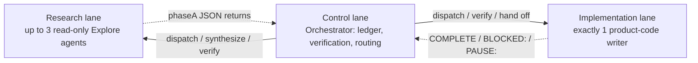
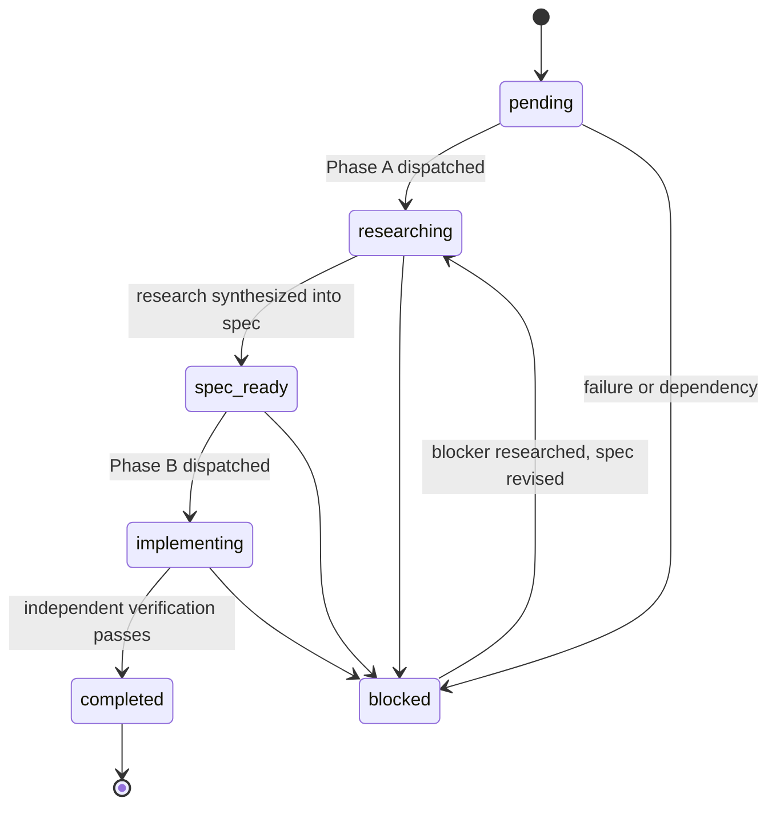

# Harness Echelon

> Nothing dispatches without the Architect's seal.

**Harness Echelon** is a lightweight, drop-in hierarchical orchestration harness for LLM coding agents. It is a pure file protocol — no code, no dependencies, nothing to install — that turns a single agent session into a governed multi-agent execution system: research always precedes implementation, exactly one agent writes product code at a time, the Architect approves the researched system blueprint before tactical work begins, and all execution state lives in reviewable files instead of chat context.

Copy four files into any codebase — five if you keep both rule entrypoints — and your agent adopts the protocol.

## Table of contents

- [Why](#why)
- [The three roles](#the-three-roles)
- [The document chain](#the-document-chain)
- [Execution model](#execution-model)
- [Task lifecycle](#task-lifecycle)
- [Safety rails](#safety-rails)
- [Repository layout](#repository-layout)
- [Quick start](#quick-start)
- [Compatibility](#compatibility)
- [Configuration](#configuration)
- [Design principles](#design-principles)
- [License](#license)

## Why

Handing a coding agent an open-ended goal tends to fail in predictable ways. Harness Echelon gives each failure a structural countermeasure:

- **Guesswork architecture.** Agents start editing before anyone agrees on the design. Harness Echelon requires iterative strategic research and explicit Architect Plan Approval in `PLAN.md` before a single task may be decomposed.
- **Unverified work cascades.** One wrong edit becomes the foundation for the next. Every Harness Echelon task carries measurable success criteria, and the Orchestrator independently verifies each completion before any dependent work starts — plus a phase-level aggregate validation gate before a phase closes.
- **Write races.** Parallel agents silently clobber each other's files. Harness Echelon runs read-only research agents concurrently but schedules exactly one product-code writer at a time.
- **Context rot.** Plans and decisions evaporate with the chat window. All state lives in files with a defined chain of custody — directive → `PLAN.md` → `.tasks.json` → `log.md` — and every major step is checkpointed to the ledger, so an interrupted session resumes from the files instead of redoing verified work.
- **Rubber-stamp reviews.** Tools that ask the human to approve everything train them to approve nothing carefully. Harness Echelon reserves human pauses for where they matter — initial Plan Approval, mid-flight architectural changes, strategic block escalations, and the occasional agent-initiated confirmation — rather than every step.

## The three roles

| Role                    | Who                     | Responsibility                                                                                                                                                                                                                       |
| ----------------------- | ----------------------- | ------------------------------------------------------------------------------------------------------------------------------------------------------------------------------------------------------------------------------------ |
| **Architect**     | You, the human          | The source of truth and ultimate authority. Issues the directive, owns the rules files, and approves the researched plan blueprint and any later architectural revision. The directive is immutable unless explicitly updated. |
| **Orchestrator**  | Your lead agent session | Owns the orchestration loop and is the sole runtime writer of `PLAN.md`, `.tasks.json`, and `log.md`. Never executes delegated research or implementation itself. |
| **Worker agents** | Ephemeral subagents     | Execute exactly one bounded task each — read-only research (*Explore*) or implementation (*general-purpose*) — then terminate with an explicit signal. They carry no state between dispatches and never coordinate each other. |

*Explore* and *general-purpose* are role names from the framework's trust table; see [Compatibility](#compatibility) for how they map on non-Claude hosts.

## The document chain

| Document                      | Tier     | Purpose                                                                                                                                                                                                                                                         |
| ----------------------------- | -------- | --------------------------------------------------------------------------------------------------------------------------------------------------------------------------------------------------------------------------------------------------------------- |
| `CLAUDE.md` / `AGENTS.md` | Rules    | The framework itself: roles, two-phase dispatch protocol, scheduler, guardrails. Identical content, two entrypoints (see [Compatibility](#compatibility)).                                                                                                        |
| `PLAN.md`                   | Strategy | The shared mental model between Architect and Orchestrator: directive, scope and boundaries, researched architecture, phase sequencing, Plan Approval, locked decisions, risks, and acceptance criteria. |
| `.tasks.json`               | Tactics  | The single source of truth for active, non-completed work: decomposed tasks, research findings, implementation specs, blockers and their resolutions (`progressEntries`), a derived per-phase health snapshot (`phaseHealth`), and the live agent registry. |
| `log.md`                    | History  | The completed-task archive: each verified task's full JSON object and its matching progress entries — including what blocked and how it resolved — moved out of the active ledger after verification.                                                         |

State flows forward through the chain — a directive is analyzed into an approved `PLAN.md`, decomposed into `.tasks.json`, and archived to `log.md` — with one deliberate back-flow: an architectural change creates a revised PENDING plan version and stales only dependent task research. When a directive completes, the runtime ledger resets while the schema template and `PLAN.md` section skeletons persist for the next one.

## Execution model

Research happens at two tiers. **Strategic plan discovery** is an iterative Architect–Orchestrator loop: agents explore system design, architectural options, trade-offs, best practices, and risks, while the Orchestrator synthesizes findings into `PLAN.md` until the plan is approved. **Tactical research** (Phase A below) runs after approval; every task receives a dedicated read-only researcher whose structured result is synthesized into the ledger and implementation spec.

### Two-phase dispatch

Every task is executed twice: once on paper, once in code.

1. **Phase A — Research (read-only).** An Explore agent investigates how to implement: reads specs, probes the codebase, checks best practices. It returns structured JSON (`phaseA_Research`) — findings, decisions, and codebase context — plus a `researchBasis` record of the files it materially relied on and the upstream contracts it assumed.
2. **Synthesis.** The Orchestrator validates the result and compiles it into a `phaseB_ImplementationSpec`: exact instructions, the files to modify, and a verification checklist. The task is now `spec_ready`.
3. **Phase B — Implementation (single writer).** A general-purpose agent executes the spec *idempotently* — it reads its targets first to detect partially-applied prior runs — and terminates with `COMPLETE`, `BLOCKED:`, or `PAUSE:`.

Research is non-negotiable. Strategic discovery may complete in one pass for genuinely simple work, but every post-approval task gets a dedicated research dispatch before implementation. The Orchestrator synthesizes returned results as they arrive rather than waiting for a full research batch.

### Three lanes

- **Research lane** — up to three concurrent read-only Explore agents. They may overlap reads freely, including research for downstream tasks against the current baseline. The Orchestrator retires terminal handles before backfilling slots and does not interrupt productive agents to reshuffle capacity.
- **Implementation lane** — exactly one product-code writer at a time, serialized in dependency and write-conflict order (`dependsOn` / `conflictsWith`), even when planned write sets look disjoint.
- **Control lane** — the Orchestrator, which owns `.tasks.json` and `log.md`. Product agents never touch state files, so the ledger is maintained safely while implementation runs.

### Lookahead: research the next phase while this one implements

Idle research capacity flows into planned future phases. Their tasks are researched and spec'd in advance and held in `lookaheadPhases` as `provisional`. Immediately before any Phase B dispatch, the recorded source files are re-read and upstream assumptions re-checked: unchanged work dispatches as-is, drift gets *bounded delta research* (a targeted re-check of only what changed, never a full re-run), and broken assumptions mark the spec `stale` so it cannot run blind. A lookahead phase is promoted to the active phase only after the current one passes its aggregate validation gate — never before.

### Signals, not silence

Every dispatch terminates with exactly one signal:

| Signal       | Meaning                                                                     | Orchestrator action                                                                                              |
| ------------ | --------------------------------------------------------------------------- | ---------------------------------------------------------------------------------------------------------------- |
| `COMPLETE` | Success (research or implementation)                                        | Synthesize/verify, then hand the writer lane to the next eligible task                                           |
| `BLOCKED:` | Cannot continue — with context, options considered, and a recommended path | Record the blocker, dispatch scoped blocker research (the blocker only, not a full re-research), revise the spec |
| `PAUSE:`   | Could continue, but needs human input first                                 | Present options to the Architect and wait                                                                        |

Timeouts are advisory checkpoints, not deadlines: elapsed wall time alone never fails a task or consumes one of its retries.

### Changing course mid-directive

Directives change. When you update one mid-execution, the Orchestrator diffs it against the approved plan version: only affected phases and dependent specs are invalidated, the revised Plan Approval becomes `PENDING`, and a strategic pause reopens research and negotiation. Demonstrably unaffected work remains valid under the prior approved version.

## Task lifecycle

Any active task may also enter `paused` — omitted from the diagram for clarity — a yielding state that retires the current handle and waits for Architect input. After the decision, the Orchestrator restores the prior state and creates a fresh dispatch. Verified completions are archived to `log.md` promptly so `.tasks.json` contains only live work.

## Safety rails

| Rail                               | What it prevents                                                                                                                                                                                       |
| ---------------------------------- | ------------------------------------------------------------------------------------------------------------------------------------------------------------------------------------------------------ |
| **Architect Plan Approval** | Tactical work on unapproved architecture — no tasks are decomposed until the blueprint is `APPROVED` in `PLAN.md`; a mid-flight architectural change creates a revised PENDING plan and pauses affected work |
| **Single-writer guard**      | Concurrent product-code edits across agents                                                                                                                                                            |
| **Agent handle lifecycle**   | Completed-but-unclosed agent handles silently starving the writer lane — handles are retired on terminal signal and tracked in the `activeAgents` registry, which is consulted before every dispatch |
| **Snapshot rule**            | Silent file corruption — read before, modify, read after, verify, on every file touched                                                                                                               |
| **Verification-first**       | Vague "done" — tasks carry measurable criteria checked by independent post-agent verification, capped by a phase-level aggregate validation gate                                                      |
| **Blocker protocol**         | Blind retries — a blocked task is never re-dispatched until bounded research investigates the blocker; retries are capped (`maxRetryLimit`, default 3)                                              |
| **Rollback protocol**        | Bad state propagating — restore the last known-good checkpoint, rewind ledger states to match, and wipe working memory of details from a rejected architecture                                        |
| **Context sanitation**       | Context bloat — workers receive only their task object, the schema fragment they must fill, and distilled constraints; never the whole ledger, history, or rulebook                                   |

These rails are protocol rules the Orchestrator enforces and verifies, not sandbox restrictions: research agents hold shell and network access and are read-only by instruction, and the single-writer guarantee is a scheduling discipline backed by verification. Hosts with enforced subagent permission models can tighten the trust table further.

## Repository layout

| File            | What it is                                                                                                                     |
| --------------- | ------------------------------------------------------------------------------------------------------------------------------ |
| `CLAUDE.md`   | Framework rules — entrypoint for Claude Code                                                                                  |
| `AGENTS.md`   | The same rules under the cross-tool `AGENTS.md` convention                                                                    |
| `PLAN.md`     | Strategic plan skeleton — section structure persists; content is cleared for the next directive                               |
| `.tasks.json` | Execution ledger — an immutable schema template (`_persistentState`) plus runtime fields that reset on directive completion |
| `log.md`      | Completed-task history — archive format and example entry                                                                     |

## Quick start

1. **Copy the files** into the root of the target codebase: `PLAN.md`, `.tasks.json`, `log.md`, and `CLAUDE.md` *or* `AGENTS.md` (whichever your tool reads — see [Compatibility](#compatibility)). If the repo already has a `CLAUDE.md`/`AGENTS.md`, append the framework rules below your existing project instructions rather than overwriting them.
2. **Open the project** in your coding agent. It picks up the rules file and adopts the Orchestrator role.
3. **State your directive** — the goal, constraints, and what success looks like. The Orchestrator seeds `PLAN.md` and dispatches strategic research agents.
4. **Approve the plan.** The Orchestrator presents the researched blueprint, architectural options, and trade-offs. Nothing is decomposed or executed until Plan Approval is recorded.
5. **Steer, don't babysit.** From here you answer `PAUSE:` gates and block escalations; research, implementation, verification, and archival run themselves.

## Compatibility

- **Claude Code** — uses `CLAUDE.md` (auto-loaded as project instructions). The framework's agent vocabulary (`Explore`, `general-purpose`) maps directly to Claude Code's built-in agent types.
- **Any tool that honors `AGENTS.md`** (e.g. OpenAI Codex, Gemini CLI, Cursor, Zed) — uses `AGENTS.md`, which carries identical rules under the standard's filename.

The framework is host-agnostic text, but its full fan-out assumes the host can dispatch subagents with distinct roles. On hosts without native subagent dispatch, the file contracts still apply and a single session can role-play both Orchestrator and workers — the process discipline survives, but the role separation and research parallelism of the full model do not.

## Configuration

All constants live as plain text in the rules file (`CLAUDE.md`/`AGENTS.md`) — edit them at will. `maxRetryLimit` is a per-task field in `.tasks.json`.

| Constant                     | Default | Meaning                                                                                   |
| ---------------------------- | ------- | ----------------------------------------------------------------------------------------- |
| `MAX_PARALLEL_EXPLORE`     | 3       | Maximum concurrently open read-only research handles (open handles, not just active work; the single writer is an additional lane) |
| `AGENT_OUTPUT_TOKEN_LIMIT` | 4000    | Agents summarize before returning if output exceeds this                                  |
| `MAX_CONTEXT_SNAPSHOTS`    | 10      | Context checkpoints retained before the oldest is trimmed                                 |
| `maxRetryLimit` (per task) | 3       | Cap on re-dispatches for a task after failed runs                                         |

## Design principles

1. **The Architect is the source of truth.** The directive anchors every analysis, plan, and decision, and changes only by explicit instruction.
2. **Research before implementation, always.** What varies is dispatch strategy, never the research itself.
3. **One writer, many readers.** Parallelism is a property of research; serialization is a property of product code.
4. **State lives in files, not chat.** Anything worth remembering is written down where the next session can read it — and resumed from.
5. **Every dispatch ends in a signal.** `COMPLETE`, `BLOCKED:`, or `PAUSE:` — never silence, never ambiguity. A paused handle is retired and resumed through a fresh dispatch after the Architect decides.
6. **Trust is bounded and task-scoped.** Agents see only what their task needs; the Orchestrator owns the rules and the routing.
7. **Active state stays lean.** Completed work is verified, archived to `log.md`, and removed from the active ledger — history is complete, the present is small.

## License

[MIT](LICENSE)
